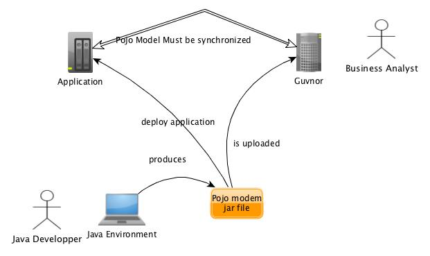
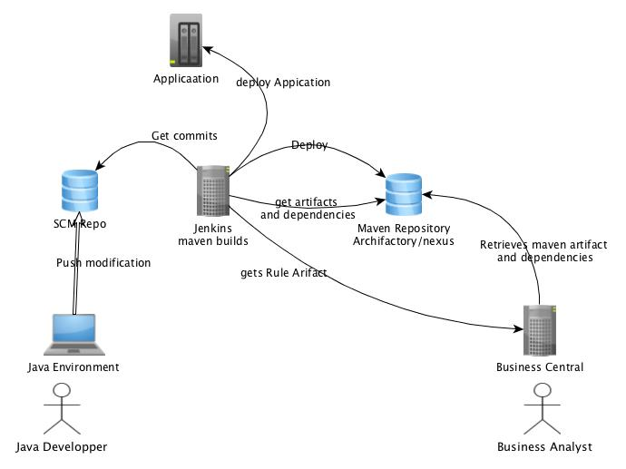

# BRMS Tutorial

In the previous part, we learned the basic of drools concepts. We did that by using a java developer tooling eclipse. 
We can not expect a Business User to use eclipse as a User interface to implement rules.
Since version 5 of drools, there is a dedicated User interface for that was called Guvnor in all versions 5.X, called kie Workbench in versions 6.x till 6.3 and is is now called Business central starting with version 6.4.
Historically, Guvnor is a BRMS=Business Rule Management System. It allowed to handle all lifecyle of a rule : 
* CRUD on a rule artifact,
* Advanced Rule Pattern like decision tables,
* RuleFlow/jbpm process definition,
* definition of deployment rules packages, etc..

All was stored in a CMS (Content Management System) Component from the apache fundation called Jackrabbit. The application Guvnor itself was a monolithic application which features was only extensible by calling its rest API.
The user interface was developed using the Google Web Toolkit (GWT) from google to develop the application in java and generate the javascript to run as a native javascript application on the browser.
All jbpm components were separated application like jbpm-console.

## What is Business central ?

In version 6, the guvnor part was completely redesigned  : 

* A new framework based on GWT but with features that helps to build a Modern business application on HTML5 : [Errai](http://erraiframework.org/) 
* a new framework was defined to define plugins to add new features : [Uberfire](http://www.uberfireframework.org/)
* Use of standard build system widely used in the java ecosystem : [Apache Maven](https://maven.apache.org/)
* Use of a file base repository versus the CMS used before : [git](https://git-scm.com/)
We will explain all this in next part.

There are now two flavors of business central : the BRMS (Business Rule Management System)  and the BPMS (Business Process Management System). 

The BPMS  contains the BRMS with all jbpm specific components : 
* Form Modeler to develop specific Human task User Interfaces
* Process instance and task management : to run the processes from within the workbench and act on human tasks.
We will see during this tutorial the BRMS part.

The drools core part itself now implements a new algorithm : PHREAK algorith (see [5.4 part of documentation](http://docs.jboss.org/drools/release/6.3.0.Final/drools-docs/html/ch05.html#PHREAK)). 

Before starting the tutorial, we shall go through a few concepts that will help to understand how to use and integrate the BRMS in a real project.

## How version 5.x BRMS was working and used in a project.

As shown in the next picture, the steps when using version 5 were the following : 
* The java developer produces the pojo model (working with the business analyst). You could in guvnor define a pojo model but with simple attributes. Most of the time, this feature was used for temporary data produces by rules and consumes by others. Therefor, no java pojo model was needed for that.
* The java archive (jar) shall be uploaded to the Guvnor (BRMS) application. On this pojo mode, the business analyst can write rules.
* The java developer produces the final application that contains the drools runtime and deploys it with the pojo model inside.

Now the application and Guvnor must have a synchronized version of the pojo model. 
There a few other points that should be taken care :  
* when upgrading a pojo model version, the two parts must be synchronized. 
* It is not possible to work in parallel. There are workarounds like duplicating the package in guvnor, etc..
* As modern java development is using a maven approach in dependency and configuration management, using Guvnor 5.x forces to have a specific build and deploy approach for it.

Guvnor is a nice tool very useful where most user interface about writing rules was kept in the Business Central (enhanced of course) but all the wrapping was redesigned. 

## How version 6 fits in modern java development process

### Maven versus Manuel Dependency management

In the 6.x BRMS, maven is fully supported in both direction : 
1. The BRMS can retrieve maven artifact from its local repository as well as from remote maven repositories.
2. The BRMS can act as a remote Maven repository and can be access from external maven builds.

Here is a typical use case : 

1. The java developer makes the pojo/entity model and pushes the code commits on the SCM repository (like a git repository). There is here an alternative where this can be done in Business Central. In this case, the maven build that concerns the final application will retrieve the pojo/entity model from the business Central repository.
2. A maven build is then started (in jenkins for example) and the pojo model is deployed on the maven repository. The maven artifact has a groupid, an artifactid and a version.
3. The business Analyst creates a new project on the Business Central application, and in the dependency list user interface, he just enters the groupid, artifactid  and the version the java developer gave him for the pojo/entity model. Maven "magic" now will come in place as Business Central will automatically retrieves from all remote maven repositories that were defined to him the pojo/entity model artifact as well as all its dependencies. 
4. When building the final application, the rule package is retrieve by its groupid, artifactid and version. Indeed, when creating a project in Business Central, you have to give it those  element. In the dependency file of the application (pom.xml), just add those identification elements as well as the url of the business central maven repository, and it works. The maven build of the application will retrieve the good version of the rule package.

In Guvnor 5.X, if a pojo model had dependencies, you had to upload them one by one with the good version. It could lead to errors and when an update was needed in the dependencies, you had to upload them one by one.
Someone may ask : why is there a need for handling dependencies ? Just make a java entity model with no dependencies. This is true and when using guvnor 5.x, we did like this as good practice because of the limit Guvnor had. But in modern application, the entity model is stored in databases using JPA or Hibernate annotations (or other framework when using nosql databases for example). Now with the maven dependency and configuration handled by business central, it is possible to use this entity model with no need to duplicate the model and then do mapping. It is no more needed.
Also, in Guvnor 5.x, we had to build package versions (called snapshot) and then somehow reference that name in the application to retrieve at runtime the good package version. We can now do both even if we only show the example the deployment of the rule package at build time of the application.

The case presented here is one use case. But using other parts of the tooling like the kie server may go to other architecture. We will present later other scenarios.

There is no mystery in this feature. It is just a way to have a good dependency and configuration management in the business Central.  In the past, we had to handle all that manually with possible human errors. The process is now automated and complies to an enterprise standard Apache Maven. Another advantage of using maven build is that the Drools community will not need to maintain a specific build process and concentrate on other feat

All this should be setup by IT and is no concern of the business analyst except the version of the rule package to use in development , integration or production environments.

### Git versus Apache jackrabbit

Guvnor 5.x was base on a Content Management System (CMS) library [Apache Jackrabbit](http://jackrabbit.apache.org/jcr/index.html). 
* All rule artifact were stored as document 
* Document modification history was kept. 
* There is a concept of workspace in which all document are stored. Guvnor used that concept to store a drools package and all its elements. So one project is stored in one workspace.
* The storage behind Apache Jackrabbit is stored in a relational database. So you could use all standard Relation Provider available on the market

To be able to communicate with the repository, a [webdav](http://www.webdav.org/) interface was [provided](https://docs.jboss.org/drools/release/5.6.0.Final/drools-guvnor-docs/html/ch09.html#d0e4162). This remote interface was very near to subversion approach. it was also possible to access the content of a  guvnor project through its [eclipse plugin](https://docs.jboss.org/drools/release/5.6.0.Final/drools-guvnor-docs/html/ch09.html#d0e4198).

This approach works very well when documents are handled. When it comes to source code, there is a need of more complex content : 
1. Branches to allow parallel development
2. It was not possible to store the content as normal source code in the IT department
3. The granularity of having one repository history for all projects was not adequate.

Indeed, when big companies were using guvnor, more than one instance of guvnor were used (one per department for example). There was a need to be able to centralize all the business rules knowledge and to allow to many department/organization to access it. A "Organizational Unit" concept was created in the 6.x version which allow to link one or more repository.

As drools is an open source project and uses itself git as a source code management repository, git was chosen to store the content of the new Guvnor version. In version 5.x, the storage was only readable by the CMS library. Now the low level storage can be directly read with a normal file explorer. There is no more need of Eclipse Plugin to access the rule project. In version 5.x all this plombing around Developer tooling took a lot of time to the drools community. With this new tooling choice, all this exists by default and the community can concentrate on other features.

As the new Guvnor version allows to store all elements of a company, it was called Business Central.

## Version 6 tooling 

As seen in the previous part, the drools community redesigned completely the BRMS tooling :  
* A new build system of the rules to make them usabale in an application (maven)
* A new repository content manager (git) to make it easier to integrate with java development tooling and minimize development needs for that by using software industry standard
* Business Central concept
* New Rule design pattern
* An open architecture to add new features with the plugin architecture 
* An execution server called kie server that simplifies the deployment of rule packages and is totally integrated in Business Central.

### Rule design pattern : decision tables,decision tree, guided rules

Guided Rule

Guided Decision Table

Guided Decision Tree

Guided Score Card

Test scenario

### Plugin Architecture to build patterns

### Execution server : kie server and Plugin architecture

