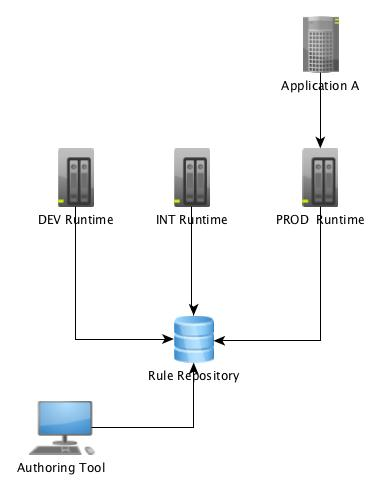
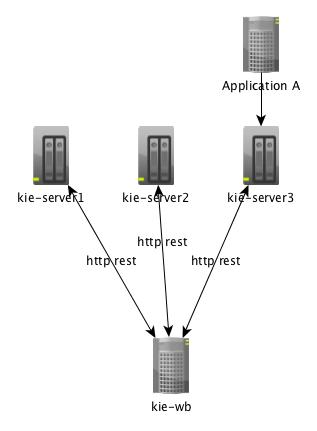

# BRMS runtime tutorial

## Using previous drools version (5.x)

In a classical drools project in previous version, the architecture was often like this : 

* an application A is going to call and use a drools service.
* a drools runtime that is built for the application using standard drools API. In many cases the runtime is using a stateless session. 
* The drools runtime is loading the rule package from a rule repository that has an authoring tool to implement the rules. This last two features were implemented using what was called Guvnor. 
* Deploying a new version of a package could be done programatically in the runtime remotely by calling the drools API feature.

An alternative of this architecture is to implement the runtime directly in the application A.

## Architecture using 6.4 version and drools API

In the 6.x serie, the Guvnor tool was replaced by what was called workbench and now Business Central. We shall call it kie-wb. 
It is possible to take the same architecture using the drools API and the kie-wb. 
There are now two possibilities
* as the business central is a maven repository, rebuild the runtime (or application if the runtime is embedded) with the new package version.
* In the runtime dynamically add to the java classpath the new jar of the rules package each time there is a new version.

## using kie-server and kie-wb together

