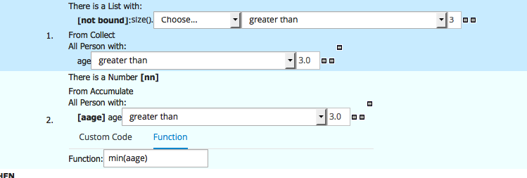
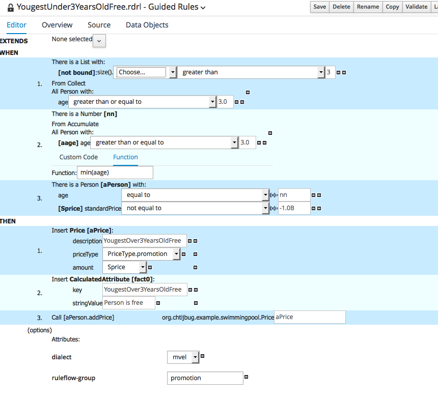
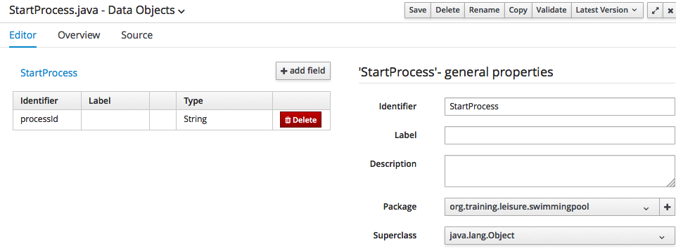
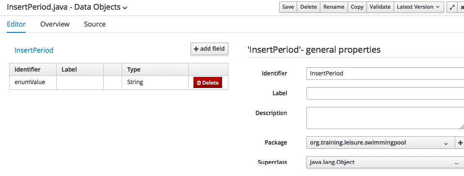
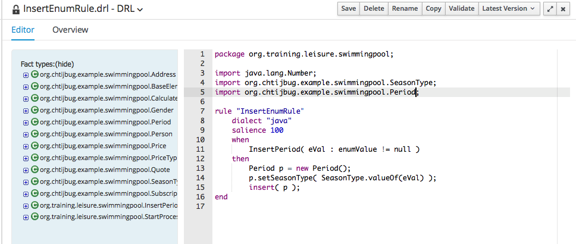

# Implementation the promotion step

## Creating the rule

Creating a new Guided Rule that you call YougestUnder3yearsOldFree

then Add a new Constraint

Select the List class.
Click on the "There is a list.." and the click on the Expression Builder button

on the first "Choose" select the size() function and on the second "greater than"

Then click on the pencil 

Click on the "From Collect" link and then  chose the person fact type 

Then click on the "All Person with" link an dselect the age attribute and add the following constraint.

Then Add a new constraint of type Accumulatte

And select the Number type from the add a pattern link.

Then make the rule look like this

## Creating rule to start a process
To be able to start a process from a test scenario, we want to insert an object and set a attribute that would be the process id we want to start.
So we first create a new Item of type Data Obkect that we shall call StartProcess. And we should add a field called procesId of type String

Then we shall create a guided rule called StartProcessRule as follows. In the Then add free form drl 

## Creating rule to insert a period

Create a drl file with the following content

## Testing the rule

